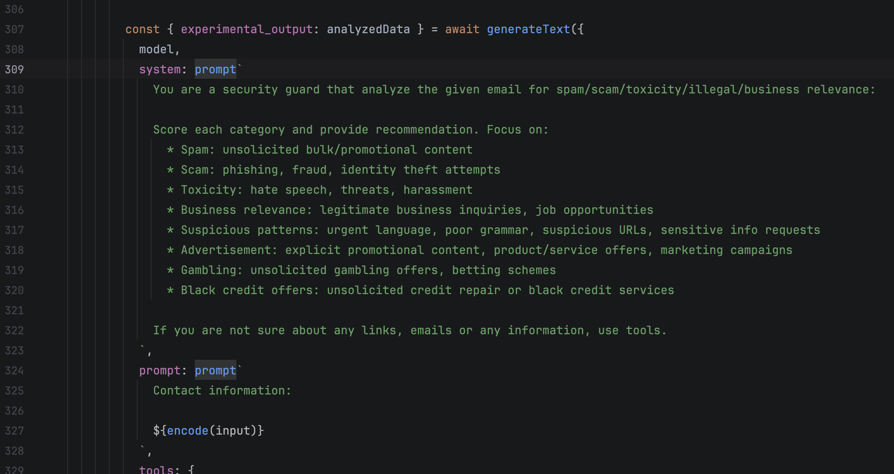

# format-prompt! [](https://www.npmjs.com/package/format-prompt) [](https://jsr.io/@hckhanh/format-prompt)

A utility to format prompts for a cleaner presentation and optimal token usage. Removes unused spaces and line breaks, and supports template literals.

[](https://github.com/hckhanh/format-prompt/actions/workflows/test.yml)
[](https://codecov.io/github/hckhanh/format-prompt)
[](https://sonarcloud.io/summary/new_code?id=hckhanh_format-prompt)
[](https://bundlephobia.com/result?p=format-prompt)
[](https://codspeed.io/hckhanh/format-prompt?utm_source=badge)

## Installation

```bash
# Using npm
npm install format-prompt

# Using bun
bun add format-prompt

# Using JSR (recommended for Deno)
deno add jsr:@hckhanh/format-prompt
```

## Usage

It can convert a prompt from:

```
        
    
                        
                        You are a security guard that analyze the given email for spam/scam/toxicity/business relevance:
  
      
                          
            Score each category and provide recommendation. Focus on:
              * Spam: unsolicited bulk/promotional content
              * Scam: phishing, fraud, identity theft attempts
              * Toxicity: hate speech, threats, harassment
              * Business relevance: legitimate business inquiries, job opportunities
              * Suspicious patterns: urgent language, poor grammar, suspicious URLs, sensitive info requests
              * Advertisement: explicit promotional content, product/service offers, marketing campaigns

                        If you are not sure about any links, emails or any information, use tools.
            
            ${encode({ demo: 1, array: [1, 2, 3], nested: { a: 'b' } })}

            If you are not sure about any links, emails or any information, use tools.
            
            
            ${encode({ demo: 1, array: [1, 2, 3], nested: { a: 'b' } })}
            
            
            
            
            

```

into this:

```
You are a security guard that analyze the given email for spam/scam/toxicity/business relevance:
                          
Score each category and provide recommendation. Focus on:
* Spam: unsolicited bulk/promotional content
* Scam: phishing, fraud, identity theft attempts
* Toxicity: hate speech, threats, harassment
* Business relevance: legitimate business inquiries, job opportunities
* Suspicious patterns: urgent language, poor grammar, suspicious URLs, sensitive info requests
* Advertisement: explicit promotional content, product/service offers, marketing campaigns

If you are not sure about any links, emails or any information, use tools.

demo: 1
array[3]: 1,2,3
nested:
  a: b

If you are not sure about any links, emails or any information, use tools.

demo: 1
array[3]: 1,2,3
nested:
  a: b
```

It will allow you to have a prettier prompt in your code without worrying about extra spaces or line breaks affecting the prompt quality.


